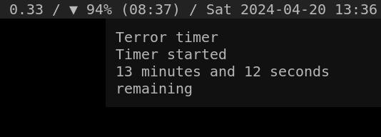

# `tt`, Terror timer

## What?

Yes.

## Screenshot?



## Why?

`tt` demilitarises [`et`](https://github.com/oxzi/et).

```diff
-    if (kill_state) {
-      show_notification("Timer was killed!", NOTIFY_URGENCY_NORMAL);
-      DIE("Timer was killed!\n");
+    if (cancel_state) {
+      show_notification("Timer was cancelled!", NOTIFY_URGENCY_NORMAL);
+      DIE("Timer was cancelled!\n");
```

## How?

Please refer to [upstream's documentation](https://github.com/oxzi/et?tab=readme-ov-file#how).
